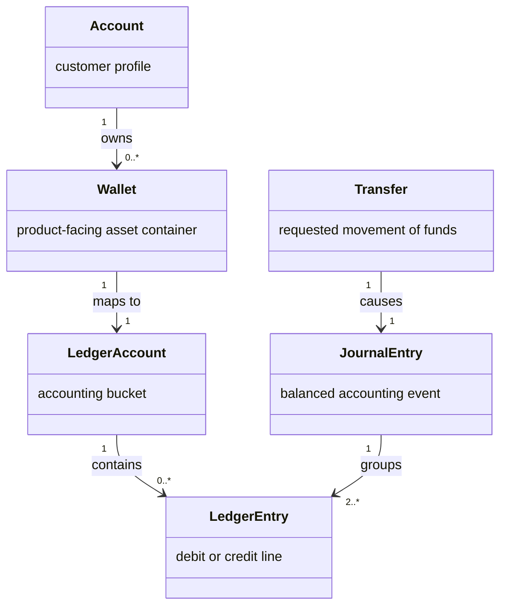

```mermaid
classDiagram

    Account "1" --> "0..*" Wallet : owns

    Wallet "1" --> "1" LedgerAccount : maps to

    LedgerAccount "1" --> "0..*" LedgerEntry : contains

    JournalEntry "1" --> "2..*" LedgerEntry : groups

    Transfer "1" --> "1" JournalEntry : causes


    class Account {
        customer profile
    }

    class Wallet {
        product-facing asset container
    }

    class LedgerAccount {
        accounting bucket
    }

    class JournalEntry {
        balanced accounting event
    }

    class LedgerEntry {
        debit or credit line
    }

    class Transfer {
        requested movement of funds
    }
```
