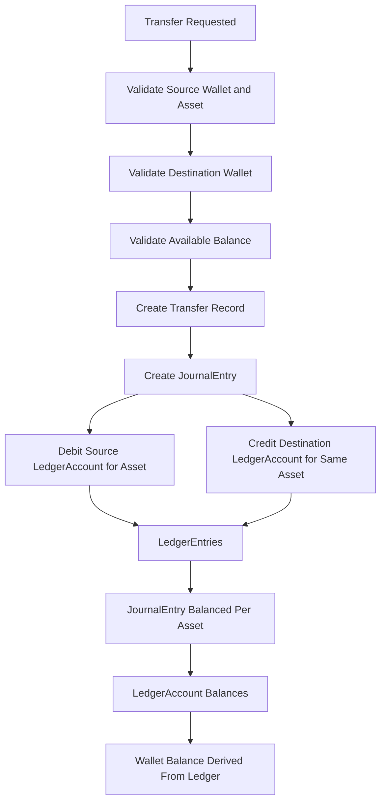

```mermaid
flowchart TD

    A[Transfer Requested]

    A --> B[Validate Source Wallet and Asset]
    B --> C[Validate Destination Wallet]
    C --> D[Validate Available Balance]

    D --> E[Create Transfer Record]

    E --> F[Create JournalEntry]

    F --> G[Debit Source LedgerAccount for Asset]
    F --> H[Credit Destination LedgerAccount for Same Asset]

    G --> I[LedgerEntries]
    H --> I

    I --> J[JournalEntry Balanced Per Asset]

    J --> K[LedgerAccount Balances]

    K --> L[Wallet Balance Derived From Ledger]
```
